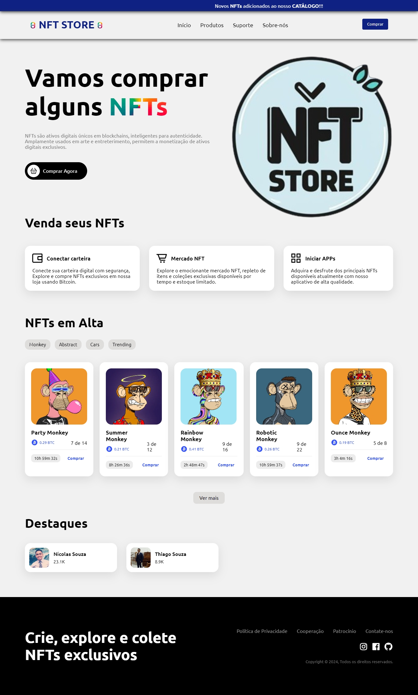

<h1 align="center">
  NFT STORE
</h1>

  

## 💻 Projeto

Este projeto tem caráter comu-educacional e tem como objetivo principal o aprimoramento das minhas habilidades em HTML e CSS. 

## 🚀 Tecnologias

- HTML
- CSS
- JS
- [AOS Animate](https://michalsnik.github.io/aos/)

## 📔 Conhecimentos abordados

- [X] Uso semântico do HTML
- [x] Animação com imagens
- [x] Váriaveis do css no `:root`
- [x] Animações com a biblioteca [AOS](https://michalsnik.github.io/aos/)
- [x] Uso do CSS Flexbox
- [x] Efeitos com a propriedade `transform`
- [X] Responsivo
